```{r}
#| label: setup
#| include: false

# Load needed libraries
# install.packages("librarian")
librarian::shelf(tidyverse, palmerpenguins, supportR)

# Prep data
peng_df <- palmerpenguins::penguins %>% 
  dplyr::mutate(body_mass_lb = body_mass_g * 0.00220462)

# Get summarized data too
peng_smry <- supportR::summary_table(data = peng_df, groups = c("species", "sex"),
  response = "body_mass_lb", drop_na = TRUE)

# Make color palettes
spp_pal <- c("Adelie" = "#66c2a5", "Gentoo" = "#fc8d62", "Chinstrap" = "#8da0cb")
sex_pal <- c("male" = "#4cc9f0", "female" = "#f72585")
```

## A Guide to Your Process

### [Scheduling]{.blue}
### [Learning Objectives]{.purple}
### [Practice]{.pink}
### [Supporting Information]{.orange}
### [Class Discussion]{.gold}

## [Today's Plan]{.blue}

- Types of Data
- Aside: Tidy Data
- Anatomy of a Graph
- Visualization Goals
- Graph Types

## [Today's Learning Objectives]{.purple}

After today's session you will be able to:

- **Define** two major types of data
- **Identify** characteristics of "tidy" data
- **Define** fundamental anatomy of a graph
- **Explain** how visualization is affected by what message you want to convey
- **Paraphrase** how you can choose what type of graph to use

## [Graphing Overview]{.orange}

- _Before_ you can get into graphing, you need to know:

\

1. What type(s) of data you have

\

2. What message you want to share with your audience

## [Types of Data]{.purple}

::::{.columns}
:::{.column width="48%"}
### Continuous

- Data _must_ be numbers

\

- Infinite options within possible range

\

- For example: height, length, profit

:::
:::{.column width="4%"}
:::
:::{.column width="48%"}
### Categorical

- Data _may_ be numbers

\

- Options limited to particular intervals

\

- For example: counts, satisfaction ratings

:::
::::

## [Types of Data - Comic]{.orange}

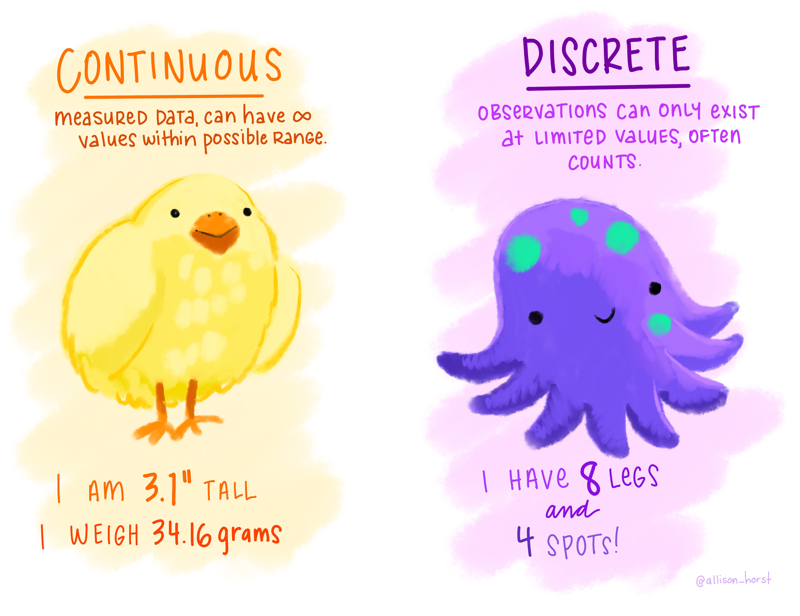{fig-alt="Comic with a bird on the left under the 'continuous' heading and some non-integer number examples and an octopus on the right under the 'discrete' heading and some integer examples" fig-align="center"}

## [Data Format Aside]{.orange}

- In order to make a graph, your data need to be "tidy"

\

- But what does it mean for data to be "tidy"?

\

- Let's dig into that

## [What is 'Tidy Data'?]{.purple}

::::{.columns}
:::{.column width="48%"}

- One row = one observation

\

- One column = one variable

\

- One cell = one data point

:::
:::{.column width="4%"}
:::
:::{.column width="48%"}

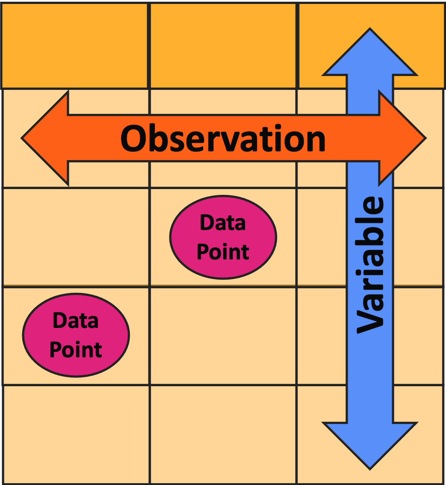{fig-alt="Cartoon data table with one column labeled as 'variable', one row as 'observation', and two cells as 'data point'" fig-align="center" fig-width="75%"}

:::
::::

## [Tidy vs. Un-Tidy Comic]{.orange}

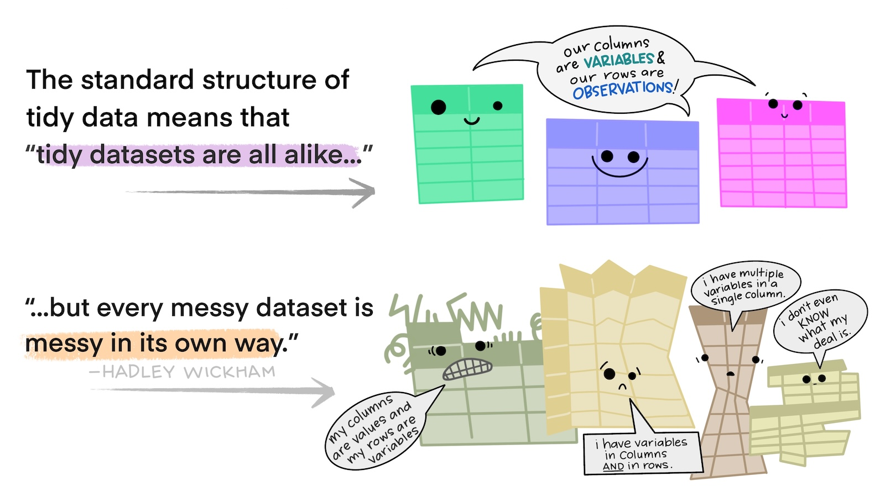{fig-alt="Cartoon of several brightly-colored, anthropomorphic tables with a speech bubble saying 'we are all tidy' above several other tables in dull colors and various, irregular shapes with a speech bubble saying 'we are untidy in different ways'" fig-align="center"}

## [Un-Tidy Example 1]{.orange}

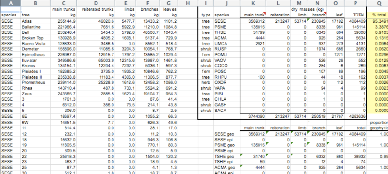{fig-alt="Screen capture of an untidy data table in MS Excel where several sub-tables are included in different places on the same sheet" fig-align="center"}

- Is every column a variable? _No!_
- Is every row an observation? _No!_

## [Un-Tidy Example 2]{.orange}

\

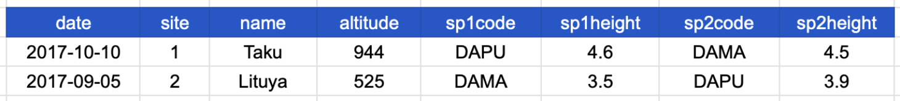{fig-alt="" fig-align="center"}

\

- Is every column a variable? **Yep**
- Is every row an observation? _No!_

## [Fixing Un-Tidy Data]{.orange}{.smaller}

- What if you realize your data are not tidy?

\

- Ideally, you'd use some sort of code language (e.g., R, Python) to fix the data
    - This is called [wrangling]{.purple}

\

- If you don't speak code, _<u>carefully</u>_ copy/pasting things is okay
    - I _**strongly**_ recommend making a copy that you don't touch before doing this!
    - That way you can check your work if you make a mistake

## [Anatomy of a Graph - P1]{.orange}

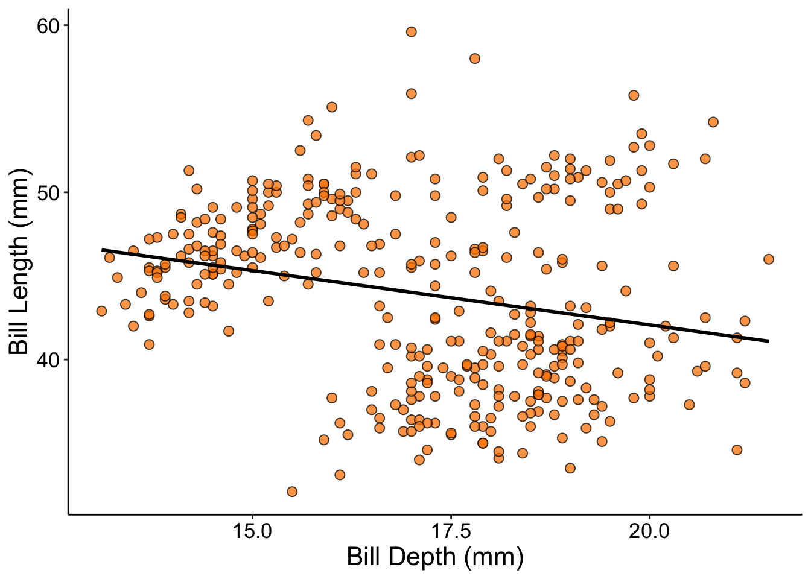{fig-alt="Scatterplot showing a negative relationship between the Y and X axes" fig-align="center"}

## [Anatomy of a Graph - P2]{.purple}

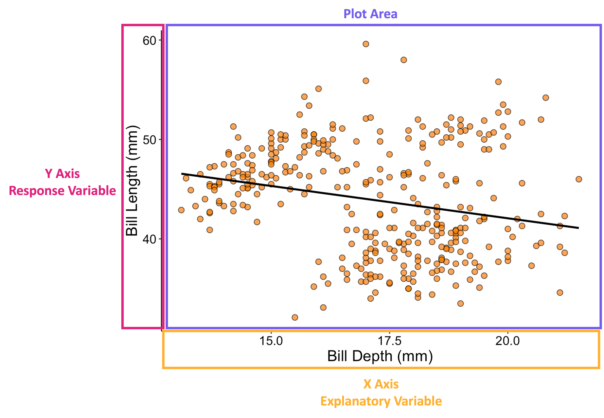{fig-alt="Same scatterplot as in prior image but with a box around the vertical axis (labeled 'y axis/response variable'), another around the horizontal axes (labeled 'x axis/explanatory variable'), and one final one around the plot area (labeled 'plot area')" fig-align="center"}

## [Anatomy of a Graph - P3]{.purple}

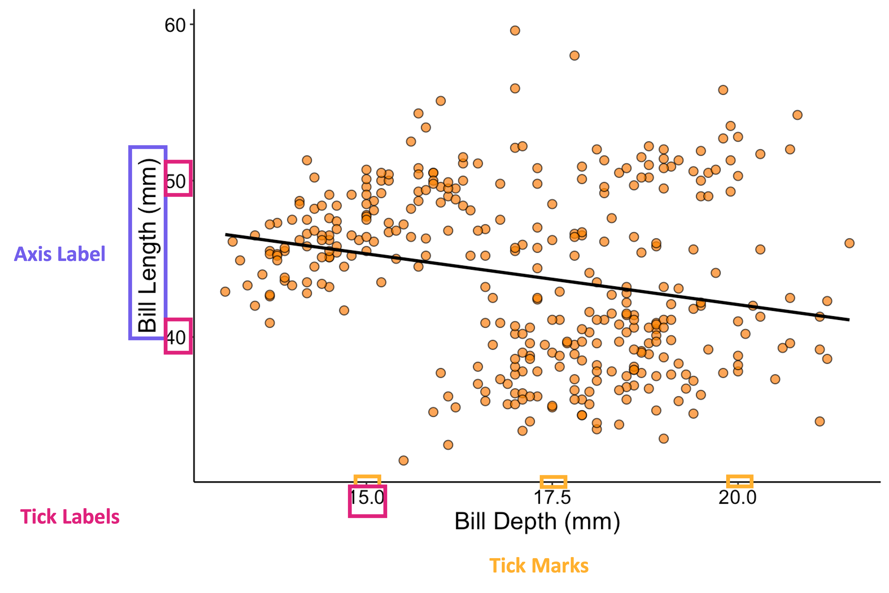{fig-alt="Same scatterplot as in prior image but with a box around the axis labels, another around the axis tick labels, and a final category of box around the tick marks themselves" fig-align="center"}

## [Choosing the Right Graph]{.orange}

- There are a _lot_ of different types of graphs you can make

\

- As you work more with data, you will hone your intuition for which is correct for a given context

\

- For now, let's consider a simplified 'roadmap' to help you as you start your data visualization journey!

## [Graph Choice Roadmap]{.purple}

\

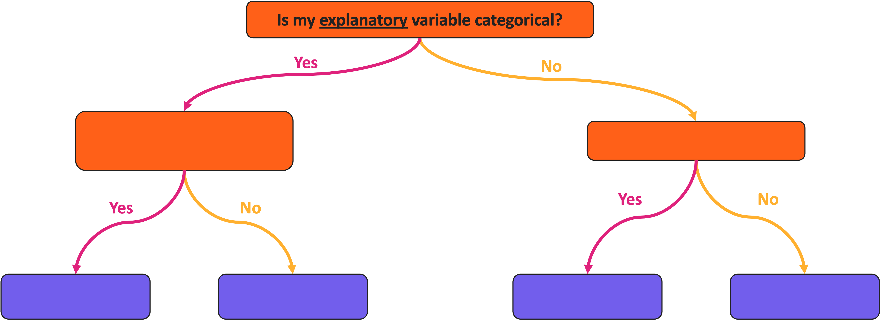{fig-alt="Visualization roadmap with a series of yes/no branching lines between colored boxes. The top box says 'is my explanatory variable categorical?'" fig-align="center"}

## [Graph Choice Roadmap]{.purple}

\

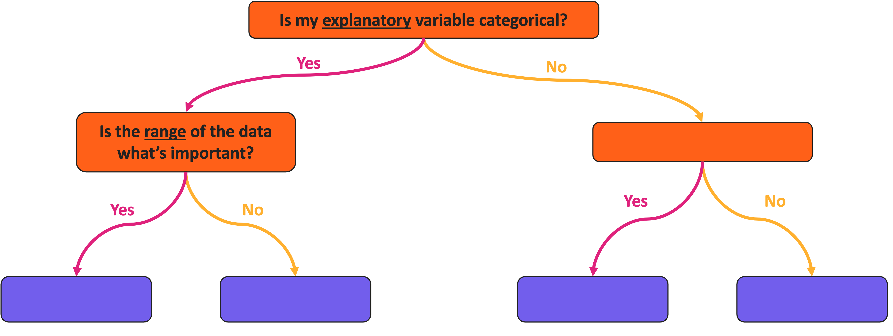{fig-alt="Visualization roadmap with a series of yes/no branching lines between colored boxes. The top box says 'is my explanatory variable categorical?'. If 'yes' another box asks 'is the range of the data what's important?'" fig-align="center"}

## [Graph Choice Roadmap]{.purple}

\

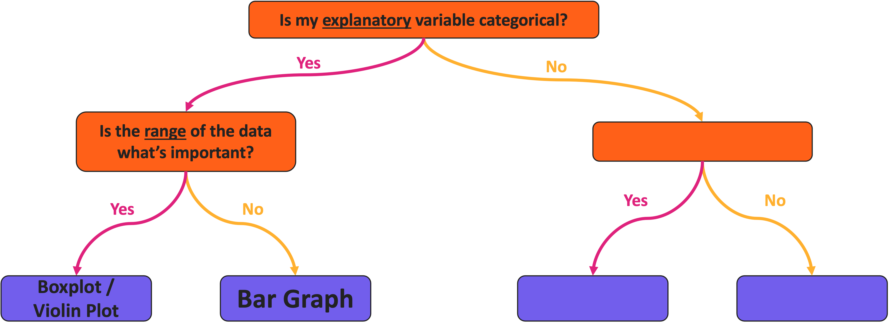{fig-alt="Visualization roadmap with a series of yes/no branching lines between colored boxes. The top box says 'is my explanatory variable categorical?'. If 'yes' another box asks 'is the range of the data what's important?'. If 'yes', then boxplot/violin plot, if 'no' then bar graph. " fig-align="center"}

## [Graph Choice Roadmap]{.purple}

\

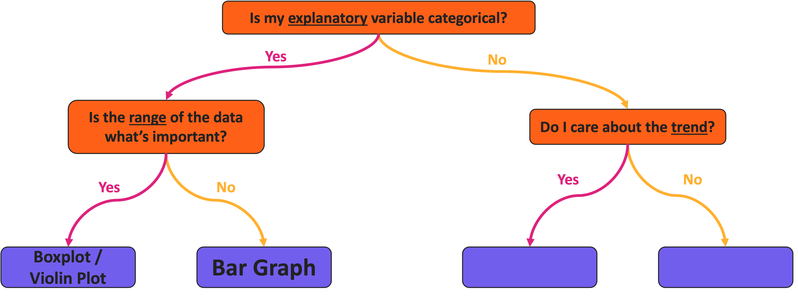{fig-alt="Visualization roadmap with a series of yes/no branching lines between colored boxes. The top box says 'is my explanatory variable categorical?'. If 'yes' another box asks 'is the range of the data what's important?'. If 'yes', then boxplot/violin plot, if 'no' then bar graph. If the explanatory variable is not categorical then another box asks 'do I care about the trend?'" fig-align="center"}

## [Graph Choice Roadmap]{.purple}

\

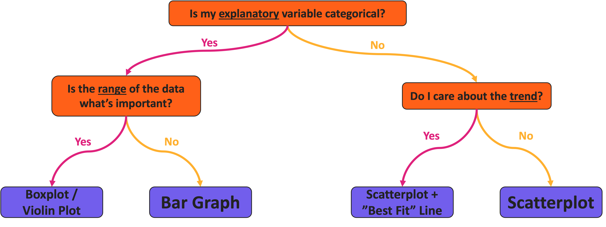{fig-alt="Visualization roadmap with a series of yes/no branching lines between colored boxes. The top box says 'is my explanatory variable categorical?'. If 'yes' another box asks 'is the range of the data what's important?'. If 'yes', then boxplot/violin plot, if 'no' then bar graph. If the explanatory variable is not categorical then another box asks 'do I care about the trend?'. If 'yes' then scatterplot plus best fit line, if 'no' then just a scatterplot" fig-align="center"}

## [Aside: Categorical Response Variable]{.orange}

- You may notice that the prior slide excluded the possibility of a categorical _response_

\

- If _both_ your explanatory and response are categorical, **you likely want a table instead of a graph**

\

- Or something that is technically a scatterplot but has relatively few points

## [Temperature Check]{.purple}

#### How are you Feeling?

<p align="center">
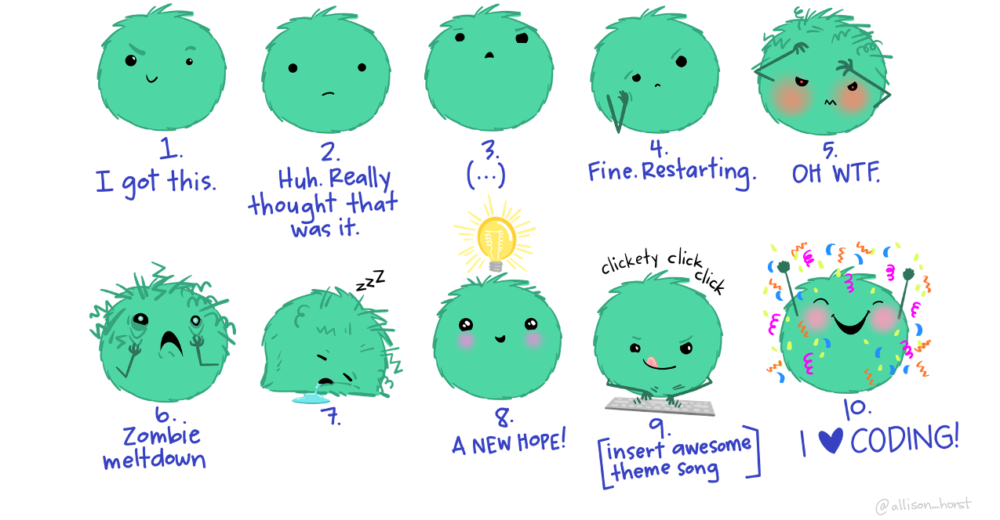
</p>

## [Graph Example: Boxplot]{.orange}

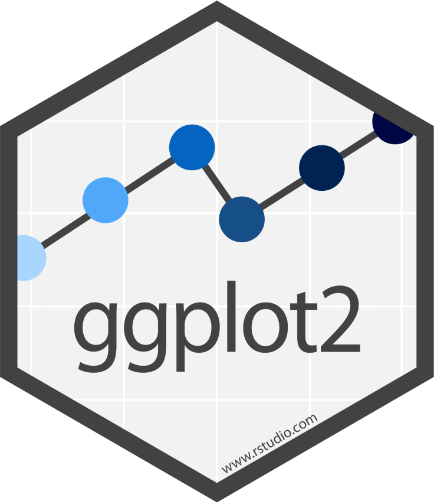{.absolute top=0 left=1100 width="12%" fig-alt="hex logo for ggplot2 R package"}
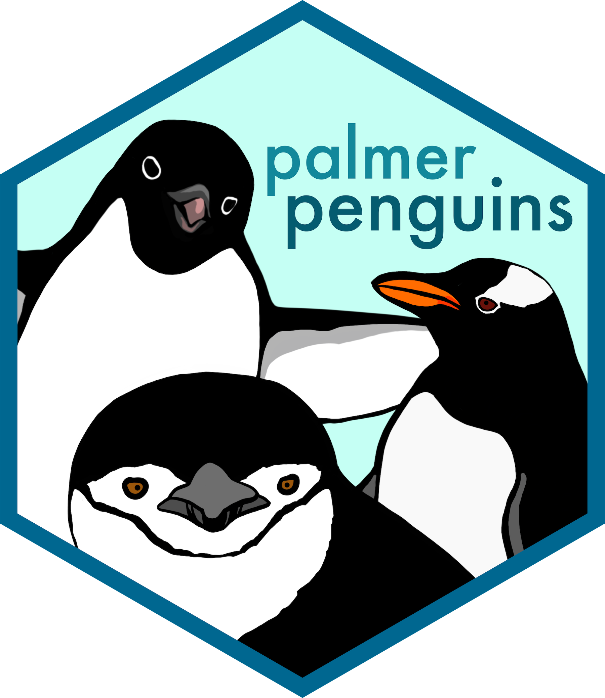{.absolute top=150 left=1100 width="12%" fig-alt="hex logo for palmerpenguins R package"}

```{r}
#| label: box
#| fig-height: 6

ggplot(peng_df, aes(x = species, y = body_mass_lb, fill = species)) +
  geom_boxplot(outlier.shape = 21) +
  labs(x = "Penguin Species", y = "Body Mass (lb)") +
  scale_fill_manual(values = spp_pal) +
  scale_y_continuous(n.breaks = 5) +
  supportR::theme_lyon()
```

## [Graph Explanation: Boxplot]{.orange}

{.absolute top=0 left=1100 width="12%" fig-alt="hex logo for ggplot2 R package"}
{.absolute top=150 left=1100 width="12%" fig-alt="hex logo for palmerpenguins R package"}

```{r}
#| label: box-v2
#| fig-height: 6

ggplot(peng_df, aes(x = species, y = body_mass_lb, fill = species)) +
  geom_boxplot(outlier.shape = 21) +
  geom_point(position = position_jitter(width = 0.25), pch = 16, color = "#000", alpha = 0.5) + 
  labs(x = "Penguin Species", y = "Body Mass (lb)") +
  scale_fill_manual(values = spp_pal) +
  scale_y_continuous(n.breaks = 5) +
  supportR::theme_lyon()
```

## [Boxplot Variant: Violin Plot]{.orange}

{.absolute top=0 left=1100 width="12%" fig-alt="hex logo for ggplot2 R package"}
{.absolute top=150 left=1100 width="12%" fig-alt="hex logo for palmerpenguins R package"}

```{r}
#| label: violin
#| fig-height: 6

ggplot(peng_df, aes(x = species, y = body_mass_lb, fill = species)) +
  geom_violin() +
  geom_point(position = position_jitter(width = 0.25), pch = 16, color = "#000", alpha = 0.5) + 
  labs(x = "Penguin Species", y = "Body Mass (lb)") +
  scale_fill_manual(values = spp_pal) +
  scale_y_continuous(n.breaks = 5) +
  supportR::theme_lyon()
```

## [Graph Example: Bar Graph]{.orange}

{.absolute top=0 left=1100 width="12%" fig-alt="hex logo for ggplot2 R package"}
{.absolute top=150 left=1100 width="12%" fig-alt="hex logo for palmerpenguins R package"}

```{r}
#| label: bar
#| fig-height: 6

ggplot(peng_smry, aes(x = species, y = mean, fill = sex)) +
  geom_bar(stat = 'identity', position = "dodge") +
  labs(x = "Penguin Species", y = "Body Mass (lb)") +
  scale_fill_manual(values = sex_pal) +
  ylim(0, 13) +
  supportR::theme_lyon()
```

## [Bar Graph Expansion: With Error Bars]{.orange}

{.absolute top=0 left=1100 width="12%" fig-alt="hex logo for ggplot2 R package"}
{.absolute top=150 left=1100 width="12%" fig-alt="hex logo for palmerpenguins R package"}

```{r}
#| label: bar-v2
#| fig-height: 6

ggplot(peng_smry, aes(x = species, y = mean, fill = sex)) +
  geom_bar(stat = 'identity', position = "dodge") +
  geom_errorbar(aes(ymax = mean + std_error, ymin = mean - std_error),
    width = 0.1, position = position_dodge(width = 1)) +
  labs(x = "Penguin Species", y = "Body Mass (lb)") +
  scale_fill_manual(values = sex_pal) +
  ylim(0, 13) +
  supportR::theme_lyon()
```

## [Bar Graph Variant: With Points!]{.orange}

{.absolute top=0 left=1100 width="12%" fig-alt="hex logo for ggplot2 R package"}
{.absolute top=150 left=1100 width="12%" fig-alt="hex logo for palmerpenguins R package"}

```{r}
#| label: bar-v3
#| fig-height: 6

ggplot(peng_smry, aes(x = species, y = mean, fill = sex)) +
  geom_point(pch = 21, size = 5, position = position_dodge(width = 1)) +
  geom_errorbar(aes(ymax = mean + std_error, ymin = mean - std_error),
    width = 0.2, position = position_dodge(width = 1)) +
  labs(x = "Penguin Species", y = "Body Mass (lb)") +
  scale_fill_manual(values = sex_pal) +
  supportR::theme_lyon()
```

## [Graph Example: Scatterplot]{.orange}

{.absolute top=0 left=1100 width="12%" fig-alt="hex logo for ggplot2 R package"}
{.absolute top=150 left=1100 width="12%" fig-alt="hex logo for palmerpenguins R package"}

```{r}
#| label: scatter
#| fig-height: 6

ggplot(peng_df, aes(x = bill_length_mm, y = bill_depth_mm, fill = 'x')) +
  geom_point(pch = 23, size = 3, fill = "#6a994e") +
  labs(x = "Bill Length (mm)", y = "Bill Depth (mm)") +
  supportR::theme_lyon()
```

## [Scatterplot Expansion: With Trendline]{.orange}

{.absolute top=0 left=1100 width="12%" fig-alt="hex logo for ggplot2 R package"}
{.absolute top=150 left=1100 width="12%" fig-alt="hex logo for palmerpenguins R package"}

```{r}
#| label: scatter-v2
#| fig-height: 6

ggplot(peng_df, aes(x = bill_length_mm, y = bill_depth_mm, fill = 'x')) +
  geom_smooth(method = "lm", formula = "y ~ x", se = FALSE, color = "#000") +
  geom_point(pch = 23, size = 3, fill = "#6a994e") +
  labs(x = "Bill Length (mm)", y = "Bill Depth (mm)") +
  supportR::theme_lyon() +
  theme(legend.position = "none")
```

## [Graph Warning: Hidden Variables]{.orange}

{.absolute top=0 left=1100 width="12%" fig-alt="hex logo for ggplot2 R package"}
{.absolute top=150 left=1100 width="12%" fig-alt="hex logo for palmerpenguins R package"}

```{r}
#| label: scatter-v3
#| fig-height: 6

ggplot(peng_df, aes(x = bill_length_mm, y = bill_depth_mm, fill = species)) +
  geom_smooth(method = "lm", formula = "y ~ x", se = FALSE, color = "#000") +
  geom_point(pch = 23, size = 3) +
  labs(x = "Bill Length (mm)", y = "Bill Depth (mm)") +
  scale_fill_manual(values = spp_pal) +
  supportR::theme_lyon()
```

## [Temperature Check]{.purple}

#### How are you Feeling?

<p align="center">

</p>

## [Pop-Quiz: Graph Choices!]{.gold}

- Let's run through some examples!

\

- [Raise your hand]{.gold} if you think you know the proper graph type to use in each of the following examples

## [Thanks! Questions?]{.cream} {background-image="images/photo_question-mark-bfly.jpg"}
